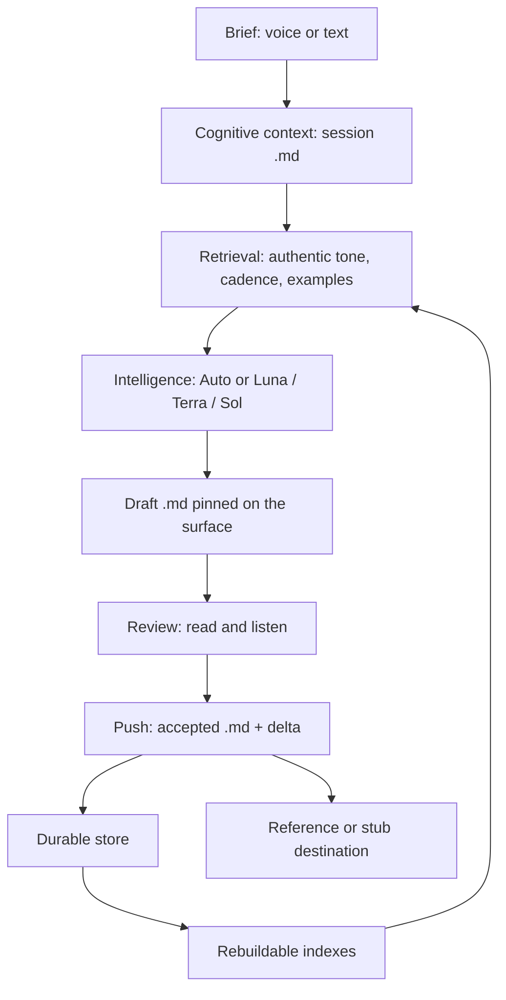

# Architecture

**Status:** first architecture iteration; **clickable stub** lives in `web/`  
**Date:** 2026-08-20  
**Governs:** how the product is built  
**Does not restate:** the problem and feel — that is the [Blueprint](../BRAINSTORMING/Second-Pen-BLUEPRINT.md)

**Now shipping (stub only):** `web/` — two-panel session, browser STT/TTS, `POST /api/draft` placeholder prompt, Push downloads `.md`. Not context assembly. See [CLICKABLE_SLICE.md](../06_ROADMAP/CLICKABLE_SLICE.md).

Engineering specs:

- [Context assembly](CONTEXT_ASSEMBLY.md) — eight steps, I/O per step
- [Data model](DATA_MODEL.md) — memory kinds, source class, hybrid FTS + pgvector
- [ADR-003](../03_DECISIONS/ADR/ADR-003-model-routing.md) — Auto / Luna / Terra / Sol selection order
- [Guardrails](../03_DECISIONS/PROTOTYPE_GUARDRAILS.md) — prototype checklist

Sources: [Blueprint](../BRAINSTORMING/Second-Pen-BLUEPRINT.md), [Path forward](../BRAINSTORMING/PATH_FORWARD.md), kickoff engine notes, and the durable / intelligence / substrate rules in this pass.

Second Pen is a light interface over frontier models. It owns copy: creative writing in Markdown. Models are engines. The product is the session — brief in, voice-shaped draft out, review by eye or ear, push.

Do not clone a Galaxy-first or project-page UI. No layer swallows another.

## System Overview

Voice is the interface. Text is the substrate.

```text
1. Experience     Voice · Listen · Mobile · Desktop (Mac OS menus) · Galaxy
2. Cognitive      .md nodes · Graph · Time · Context
3. Intelligence   Auto / Luna / Terra / Sol · retrieval
4. Durable        Markdown · relationships · history
5. References     pointers (provider, external_id, canonical_url)
6. External SoR   apps that own the file (later)
```

The person lives on layer 1. The session loop is:

**dictate or type → retrieve authentic voice → generate for destination → critique once → review (read / listen) → edit → push**

Push writes durable Markdown and a learning delta. Operational indexes update from that source. External systems of record are optional and later.



## Six layers

No layer swallows another. Experience must not become a CMS. Durable must not become a model. Intelligence must not own the files.

### 1. Experience

What they use: Voice in, Listen out, a pinned draft, a **writing mode** (genre pills), Push. Desktop and mobile are the same product. On Mac, desktop is a document app: native File / Open / Close / Folder / Projects in the OS menu bar, not in-page chrome. Galaxy is a visualization of the relationship graph, not the home screen and not the product. Holding UI: `docs/UI:UX/holding-hero-reference.png` — reference only, not approved.

Day-one surface controls that are allowed to be visible:

- Writing mode (CTA pill → genres). **Call-out:** craft, not a nav bar.
- Voice lane (CTA pill below → author / brand / system, with harness pills). **Call-out:** each write, not onboarding; not a brand/corpus library.
- Auto (toggle: structure-keeping mode for dumps and large projects)
- Routing picker (Luna / Terra / Sol), exposed from day one as routing, not as a settings tour

History, Galaxy, seed, and settings stay quiet corners.

### 2. Cognitive

Thought is stored as text. The principal object is a **.md**: a cheap unit of copy or context (session notes, brief, draft version, accepted copy, seed writing, decision, meeting, artifact reference).

A .md may belong to a day, a project, a craft, and a person at once. Chronology coexists with semantic organization. Relationships are first-class. The Galaxy draws that graph; it is not the graph.

### 3. Intelligence

Frontier models are the powerhouse. Second Pen is the light interface people actually use. It caches and maintains identity, history, context, permissions, persistence, and relationships (when those exist).

What they feel: **Auto** — an LLM that keeps structure. That is a toggle, used for data dumps of text and large projects.

Underneath: **Luna** (cheap / routine), **Terra** (default work), **Sol** (hard reasoning). Cost, latency, and capability are routing concerns. The policy lives in-repo (`web/lib/route-job.ts`): most drafts are Terra on a cheap model; Sol only for seed/reflection or long structural drafts. Model ids are env, so we or a user can retarget a tier without a fork. Transport is OpenAI-compatible HTTP ([ADR-005](../03_DECISIONS/ADR/ADR-005-generation-adapter.md)). Do not fork a public LLM-router repo.

AI sits above retrieval:

1. Find the author's real tone and cadence (authentic lane).
2. Optionally compare to a journalist or writer they like (influence lane — technique, never identity).
3. Keep links back to sources.
4. Loop until the output meets the requirement, bounded: one critic pass, one controlled rewrite, then the human.

A model turn emits structured events (`create markdown`, `link project`, `add relationship`, …) in addition to prose. Events write durable text. They do not overwrite human material.

### 4. Durable

Canonical persistence is lightweight Markdown (or Markdown-compatible). If the application disappeared, the intellectual history would still be readable as a folder of text.

Operational indexes — search, graph cache, embeddings, cluster assignments, AI tags, summaries — are **derived and disposable**. They rebuild from the Markdown.

Human material is not overwritten unless the user explicitly overrides that in settings.

Every meaningful interaction generates timestamped state. Push is the session's durable commit: generated version, edited version, accepted version, as Markdown, with relationships.

### 5. References

Pointers, not files. `provider`, `external_id`, `canonical_url`, plus edges. Used for authentic-source URLs, influence URLs, and later destination documents.

Optional ingestion copies text into search and AI. It does not make Second Pen the owner of the remote file.

### 6. External systems of record

External apps stay systems of record. OAuth, sync, webhooks, and workers exist so week-three destination and corpus connections work. They are not day-one UI and not day-one architecture blockers.

Day one copy in/out is Markdown the person pastes, uploads, or exports.

## Major Components

| Component | Layer | Job |
|---|---|---|
| Working surface | Experience | Hybrid input stream + pinned draft + Listen + Push |
| STT / TTS adapters | Experience / Intelligence | Dictate in, listen out |
| Session / Draft / Writing mode / Push | Cognitive | Software identities for the Blueprint loop |
| Retriever | Intelligence | Authentic lane, later influence lane, later facts lane |
| Router | Intelligence | Auto toggle + Luna / Terra / Sol |
| Generator + critic | Intelligence | Bounded draft → one critique → one rewrite |
| Markdown store | Durable | Canonical .md tree, timestamped versions |
| Indexer | Durable → operational | Embeddings, graph cache, search — rebuildable |
| Reference records | References | Pointers to SoR |
| SoR connectors | External | Later. Week three, not login. |

Kickoff dashboard / library / profiles / evaluations are **not** components of this app.

## Data Flow

1. Brief arrives as speech or text → session `.md`.
2. Retriever loads authentic voice profile (derived) and authentic example passages (from `.md` seed and prior accepted copy). Source class is required: owned / authorized / influence / reference / generated.
3. Router selects Luna, Terra, Sol, or Auto.
4. Generator writes a draft `.md` with a context manifest (voice version, destination, example IDs, model, prompt version).
5. Critic returns structured results. At most one rewrite.
6. Overlap check against influence sources if any are in play.
7. Person reads, listens, edits. Edits are human material.
8. Push writes accepted `.md`, stores the delta, emits structured events, updates indexes. Outbound destination may be a stub.
9. Reflection may propose a voice-profile update. Proposals are derived. They do not overwrite seed writing.

## Trust Boundaries

- **Device / browser:** capture of mic, local draft editor, playback.
- **Second Pen app:** session, routing, retrieval, persistence, permissions.
- **Model providers:** see prompts and retrieved passages; they do not own the Markdown store.
- **Object store:** canonical `.md`.
- **Operational database:** disposable indexes. Compromise here must not be the only copy of the writing.
- **External SoR:** later; least privilege; references not replicas as the source of truth.

Generated drafts never become authentic examples automatically.

## Mapping to the session objects

| Blueprint object | Durable form |
|---|---|
| Session | Timestamped session `.md` (brief, notes, writing mode, routing) |
| Draft | Versioned draft `.md` (initial, critic_revision, user_revision) |
| Writing mode | Parameter on the session + mechanics profile (what the draft is allowed to be) |
| Push destination | Later: where accepted copy ships. Not the genre picker. |

## Context assembly and memory

Do not treat the lists below as the spec. Full I/O is in [CONTEXT_ASSEMBLY.md](CONTEXT_ASSEMBLY.md). Classification and indexing are in [DATA_MODEL.md](DATA_MODEL.md).

Assembly order (authentic voice dominant): voice → objective → audience → destination mechanics → authentic examples → optional influence → guardrails → facts. Audience and guardrails are engine fields, not home-screen settings.

Memory kinds (one kind per file; split if needed): episodic = the writing; semantic = claims about writing; reflective = changes to semantic memory. Example retrieval is episodic + owned, hybrid FTS then vector.

Routing: [ADR-003](../03_DECISIONS/ADR/ADR-003-model-routing.md). Internal jobs are Luna. User pin wins for drafts. Default draft is Terra.

## Open Architecture Questions

- Exact Markdown folder convention (`people/{id}/accepted/`, `sessions/{id}/`, `seeds/`, `drafts/{id}/vN.md` is a sketch).
- R2 vs Vercel Blob (shape settled; vendor open — [STACK_DECISIONS.md](../03_DECISIONS/STACK_DECISIONS.md)).
- STT and TTS vendors.
- Models behind Luna / Terra / Sol.
- Whether the picker collapses on mobile; the routing table still applies.
- Galaxy: visualization only until a written decision reopens it.
- Influence comparison loop: reserved lane; no v1 UI.
