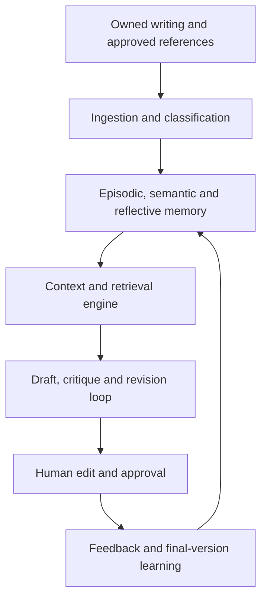

# Second Pen — Prototype Architecture

> **Role:** engine noodling. Do not copy this into `docs/02_ARCHITECTURE/ARCHITECTURE.md`.  
> **Read first:** [Second-Pen-BLUEPRINT.md](Second-Pen-BLUEPRINT.md) and [PATH_FORWARD.md](PATH_FORWARD.md).  
> Keep the memory, retrieval, and learning rules. Discard the dashboard / library / profiles tree as the product.

## Corrections vs this file’s original body (2026-08-20)

This file was the second stale source (product-definition was the first). The body below is archive. Do not implement it as written. Path forward **inverts** these lines:

| Original in this file | Correction |
|---|---|
| First proof: import → voice profile → influences → retrieve → draft | Product proof is the Blueprint session: quiet seed → brief → destination draft → listen/edit → push. The import pipeline is engine-only. |
| First formats: email and social post | First destinations: Reel, web copy, manual, script. |
| Mobile application deferred | **Phone dictation is the primary surface.** Desktop does not lead. |
| App tree: dashboard, library, profiles, compose, evaluations | Not product routes. Engine map only. |
| Build phases 0–7 (corpus UI before session) | Session loop first, seed underneath, influence later. |
| Oracle / VECTOR(1024) as stack | Research reference only. Hosting: [ADR-001](../03_DECISIONS/ADR/ADR-001-hosting-and-data-plane.md). |
| Evaluation harness as prototype must | Internal / `prototypes/` only. Not a screen. |
| Influence profiles in the first prototype UI | Reserved lane. No v1 UI. |
| Implementation gate: full influence ingestion + evaluation | Gate is: authentic vs influence vs facts cannot merge. Then explicit allow to scaffold. |

## Document Status

**Phase:** Prototype Architecture  
**Repository:** `second-pen`  
**Architecture Type:** Baseline plus Dual-Source Writing Influence Extension  
**Implementation Status:** Pre-scaffold / architectural definition  
**Product surface:** subordinated to the Blueprint

## Key Conclusion

Build this as a new private repository, using the Oracle project as a reference implementation—not as the long-term fork of the entire Oracle developer hub.

The first complete proof should be:

**Import authentic writing → build a voice profile → retrieve relevant examples → generate a draft → capture the user’s edits → learn from the final version → demonstrate that the next draft improves**

That is the vertical slice worth proving before adding integrations, multiple writing formats or complex agent orchestration.

---

# PART I — BASELINE ARCHITECTURE

## 1. What the Oracle reference actually does

The article implements three memory layers:

| Memory | Stored information | Purpose |
|---|---|---|
| Episodic | Previous posts and embeddings | Retrieve similar examples |
| Semantic | Structured JSON style profile | Explain how the person writes |
| Reflective | Profile changes over time | Let the voice evolve conservatively |

Generation itself is deliberately small:

1. Receive a topic and platform.
2. Load the current style profile.
3. Retrieve five semantically similar posts.
4. Inject both into the prompt.
5. Generate one draft.
6. Save the final published post.
7. Reflect after every five new posts.

That is a strong architectural principle: the intelligence comes primarily from supplying the right memory, not from building an enormous prompt or agent swarm.

Oracle article:

https://blogs.oracle.com/developers/how-i-taught-an-ai-to-sound-like-me-agent-memory-with-oracle-database-26ai

The reference implementation uses Node.js, Express, TypeScript, React/Vite, Oracle AI Database, OCI-hosted Cohere models and three primary tables.

Oracle companion implementation:

https://github.com/oracle-devrel/oracle-ai-developer-hub/tree/main/apps/oracle-agent-memory

## 2. What should be retained

Retain these concepts almost exactly:

- Three distinct memory types.
- Structured, versioned voice profiles.
- Semantic retrieval of relevant writing examples.
- Platform- and format-specific retrieval.
- Conservative profile updates.
- Reflection logs that support rollback.
- Soft deletion and “forget this example.”
- Provider wrappers around generation and embeddings.
- A small, inspectable generation pipeline.
- Real final writing as the primary learning signal.

## 3. What the Oracle demonstration is missing

It is a good technical demonstration, but it is not yet a product.

### A. It does not learn from the editing process

The system stores the final published post, but not:

**AI draft → user edit → final version**

That edit delta may be the most valuable training signal in the entire product. It tells the system exactly what the user disliked and what they changed.

We should preserve:

- Original AI draft
- Every important revision
- Final accepted version
- Words removed
- Words added
- Structural changes
- User rating
- User-selected reason for editing

### B. It only handles social posts

The concept should eventually support:

- Emails
- Social posts
- Articles
- Product descriptions
- Founder communications
- Strategy documents
- Technical summaries
- Sales communications
- Investor updates

Each format needs its own structural rules without creating an entirely separate voice.

### C. It mixes voice and content too easily

The system must distinguish:

- **Voice:** how the user writes
- **Knowledge:** what the user or organization knows
- **Format:** email, article, social post or memo
- **Intent:** persuade, explain, request or challenge
- **Audience:** engineer, customer, investor or supplier
- **Influence:** qualities borrowed from another writer

Those should be separate context layers.

### D. It lacks proper evaluation

There is no controlled evidence that draft quality is improving.

We need a permanent evaluation set that tests:

- Voice similarity
- Generic-AI phrase usage
- Factual preservation
- Format compliance
- Excessive copying
- User edit distance
- Draft acceptance rate

### E. It trusts the reflection model too much

The Oracle example asks the model for a profile diff and applies it.

For production, every proposed update should:

1. Reference supporting examples.
2. Pass schema validation.
3. Stay within defined modification limits.
4. Create a new profile version.
5. Be reversible.
6. Optionally require user approval for major changes.

### F. It is coupled to Oracle and specific model dimensions

The demonstration uses a `VECTOR(1024)` column tied to its selected OCI embedding model.

Changing the embedding model may require re-embedding the corpus and modifying the schema.

The repository should record:

- Embedding provider
- Embedding model
- Vector dimensions
- Embedding version
- Date embedded

### G. Authentication and tenant isolation are incomplete

The example uses a demo user ID and application-level `user_id` filtering.

A production product needs:

- Authentication
- Workspace ownership
- Database-enforced tenant isolation
- Export and deletion
- Source permissions
- Audit logs
- Encryption
- Clear data-retention controls

## 4. Baseline product architecture

The generation loop should remain bounded:
Draft → voice critic → one controlled rewrite → user review
Do not let multiple agents endlessly rewrite the same text.
One critique pass and one revision pass should be the prototype default.
5. Baseline voice hierarchy
The system should assemble writing context in this order:
User’s authentic voice
Current communication objective
Audience
Document format
Relevant prior examples
Optional writing influences
Explicit constraints and prohibited language
6. Authentic voice versus influence
These should never be merged into the same underlying profile.
Authentic Voice Profile
Natural tone
Sentence rhythm
Structural habits
Vocabulary
Recurring reasoning patterns
Things the user avoids
Influence Profile
Desired clarity
Degree of directness
Narrative style
Argument structure
Energy or formality
If another author is used as an influence, the product should extract broad characteristics rather than copying distinctive phrases.
The user’s authentic writing should remain the dominant layer.
A possible conceptual control:
Authentic voice: 70%
Selected influence: 15%
Format requirements: 10%
Task-specific direction: 5%
These should initially be conceptual weights used by the context builder, not mathematically precise claims.
7. Baseline repository structure
second-pen/
│   │   ├── app/
│   │   │   ├── dashboard/
│   │   │   ├── library/
│   │   │   ├── profiles/
│   │   │   ├── compose/
│   │   │   ├── evaluations/
│   │   │   └── api/
│   │   └── components/
│   │
│   └── worker/
│       ├── ingestion/
│       ├── embeddings/
│       ├── reflection/
│       └── evaluations/
│
├── packages/
│   ├── ai/
│   │   ├── providers/
│   │   ├── generation/
│   │   ├── embeddings/
│   │   ├── critique/
│   │   └── schemas/
│   │
│   ├── memory/
│   │   ├── episodic/
│   │   ├── semantic/
│   │   ├── reflective/
│   │   └── retrieval/
│   │
│   ├── ingestion/
│   │   ├── parsers/
│   │   ├── normalization/
│   │   ├── classification/
│   │   └── chunking/
│   │
│   ├── database/
│   │   ├── schema/
│   │   ├── migrations/
│   │   ├── queries/
│   │   └── policies/
│   │
│   ├── evaluations/
│   │   ├── fixtures/
│   │   ├── scorers/
│   │   └── reports/
│   │
│   └── shared/
│       ├── types/
│       ├── validation/
│       └── constants/
│
├── docs/
│   ├── product-brief.md
│   ├── architecture.md
│   ├── memory-model.md
│   ├── voice-profile-schema.md
│   ├── evaluation-strategy.md
│   ├── security-and-privacy.md
│   └── decisions/
│
├── tests/
│   ├── unit/
│   ├── integration/
│   └── end-to-end/
│
├── infra/
├── scripts/
├── .env.example
├── README.md
└── package.json
This is still one repository, but separates the web interface, background processing and reusable intelligence cleanly.
8. Baseline data model
Table
Purpose
users
User identity
workspaces
Personal or team boundary
source_collections
Groups such as “David emails” or “Founder posts”
source_documents
Original uploaded documents
source_passages
Searchable passages and embeddings
voice_profiles
Current active profile
voice_profile_versions
Complete version history
reflection_runs
Proposed and accepted profile changes
writing_projects
Individual writing assignments
drafts
Generated drafts
draft_revisions
Draft-to-final edit history
feedback_events
Ratings and specific corrections
guardrails
Required and prohibited writing rules
evaluation_cases
Permanent test prompts
evaluation_runs
Quality results by model and prompt version

Every source should also carry:
source_type:
- owned
- authorized
- influence
- reference
- generated

content_type:
- email
- social_post
- article
- memo
- technical
- marketing
- other
That prevents an influence author’s work from being confused with the user’s authentic voice.
9. Baseline technical stack
For a lean first product:
Layer
Recommendation
Application
TypeScript + Next.js
Database
PostgreSQL
Vector search
pgvector
Authentication
Managed authentication provider
Storage
S3-compatible object storage
Background work
Database-backed job queue initially
Validation
Runtime schemas for every AI response
AI providers
Provider-adapter interface
Testing
Unit, integration and fixed-corpus evaluations
Deployment
Managed web hosting plus managed PostgreSQL

Next.js Route Handlers allow the UI and initial API to coexist in one application, which is appropriate for the first vertical slice.
Reference:
https://nextjs.org/docs/app/getting-started/route-handlers
PostgreSQL with pgvector can keep relational data, metadata filtering, vectors and full-text search together.
It supports exact search, HNSW indexing and hybrid vector/full-text retrieval.
Reference:
https://github.com/pgvector/pgvector
Oracle versus PostgreSQL
Use Oracle if:
Oracle is a strategic commercial relationship.
OCI deployment is already planned.
Enterprise Oracle customers are the target.
Its integrated vector, JSON and database model is a selling point.
Use PostgreSQL initially if:
The priority is fast, inexpensive product validation.
Broad hosting choices are desirable.
The application should remain model- and cloud-neutral.
The early corpus will be relatively small.
The prototype recommendation is PostgreSQL plus pgvector, while keeping the memory interfaces sufficiently clean that Oracle can later be supported as an enterprise adapter.
10. Baseline development phases
Phase 0 — Repository foundation
Build:
Private repository
README
Product brief
Architecture decision records
Environment schema
Formatting, linting and tests
CI checks
Database migrations
Model-provider interfaces
Exit condition:
A clean installation can start the application,
connect to the database and run one test AI call.
Phase 1 — Corpus ingestion
Build:
Paste-text ingestion
Markdown and plain-text upload
Document classification
Source ownership designation
Text normalization
Passage creation
Embedding generation
Duplicate detection
Corpus browser
Delete and reprocess controls
Start with manually pasted text and file upload.
Do not begin with Gmail, Google Docs, LinkedIn and every other connector.
Exit condition:
Import 20–50 authentic samples and confirm that
relevant samples can be retrieved by topic and format.
Phase 2 — Voice-profile creation
Build:
Voice-analysis schema
Initial profile-generation prompt
Platform and format characteristics
Forbidden phrases
Signature patterns
Profile editor
Profile versioning
Evidence linked to every extracted trait
Exit condition:
The user can inspect each claimed voice characteristic,
see supporting evidence and correct incorrect conclusions.
Phase 3 — First drafting loop
Build:
Writing brief
Audience selection
Format selection
Intent selection
Relevant-example retrieval
Context assembly
Draft generation
Voice-critic pass
One controlled revision
Draft provenance display
Exit condition:
Topic → retrieved evidence → draft → critique → revised draft
works as one traceable sequence.
Phase 4 — Edit-based learning
Build:
In-browser editing
Draft-versus-final diff
Feedback capture
Accepted and rejected language
Final-version storage
Edit-pattern summaries
Repeated-correction detection
The system should learn patterns such as:
The user consistently removes:
- inflated claims
- generic introductions
- excessive headings
- unnecessary conclusions
- corporate AI vocabulary
Exit condition:
The system can identify recurring edits and propose
specific, evidence-backed profile changes.
Phase 5 — Reflective memory
Build:
Reflection trigger
Minimum evidence threshold
Structured additions and removals
Profile-version snapshots
Approval controls
Rollback
Rebuild profile from selected sources
Complete deletion propagation
Exit condition:
A bad reflection can be identified and rolled back
without rebuilding the entire account.
Phase 6 — Evaluation harness
Create 10–20 fixed writing assignments covering:
Short email
Supplier follow-up
Engineering summary
Founder post
Investor update
Product explanation
Direct corrective message
Longer strategy document
Measure:
Metric
Meaning
Edit distance
How much the user changes
First-draft acceptance
How often the first draft is usable
Voice score
Human rating for authenticity
Constraint compliance
Required and prohibited language
Factual preservation
Whether source facts remain correct
Retrieval relevance
Whether useful examples were selected
Phrase overlap
Whether examples were copied too closely
Cost
Model expense per accepted draft
Latency
Time to first usable draft

The primary product metric should be:
How much work remains between the generated draft and the user-approved final version?
Phase 7 — Production hardening
Add:
Authentication
Workspace isolation
Database row-level security
Encryption
Rate limits
Audit logging
Data export
Complete account deletion
Failure recovery
Usage and model-cost reporting
Prompt and model version tracking
Background-job retries
Monitoring
11. Baseline MVP boundary
The MVP should include:
One user
One authentic voice
Text and Markdown ingestion
Email and social-post formats
Structured voice profile
Similar-example retrieval
Draft and one revision pass
Draft-to-final diff
Reflection with rollback
Fixed evaluation set
Provider abstraction
Delay:
Gmail ingestion
Google Docs ingestion
Browser extension
Team workspaces
Public author marketplace
Voice sharing
Complex multi-agent orchestration
Mobile application
Automated publishing
Dozens of model providers
Fine-tuning
12. How to handle the Oracle repository
Star the Oracle repository.
Put it in a GitHub List such as Reference Architecture.
Record the exact commit in the reference-repo index.
Maintain a new private second-pen repository.
Link the Oracle article and source under the research documentation.
Reimplement the architectural pattern using the Second Pen domain model.
Copy source only where it genuinely saves work and preserve any required licence notices.
The Oracle developer hub is licensed under Oracle’s Universal Permissive License.
The repository also explicitly states that it has not necessarily received a customary security review.
Reference:
https://github.com/oracle-devrel/oracle-ai-developer-hub
13. Baseline product definition
Second Pen is a memory-driven writing system that learns how a person actually communicates from their authentic writing, retrieves relevant examples for each assignment, applies explicit voice and format guardrails, and improves over time by studying the difference between its drafts and the user’s approved final work.
The most important improvement over the Oracle demonstration is:
Do not merely learn from what the user published. Learn from how the user corrected the system before publishing it.

PART II — PROTOTYPE EXTENSION: AUTHENTIC SOURCES AND WRITING INFLUENCES
14. Extended prototype definition
The baseline architecture learns how the user writes from their own historical writing.
The extended prototype adds a second capability:
The user may identify authors, journalists or other writers whose structural approach they admire, and Second Pen may use approved examples of that work to guide writing technique without treating the external writer’s language as the user’s own voice.
The system therefore learns from two different source families:
The user’s authentic authored work
Approved external writing influences
These source families must be stored, analyzed, retrieved and weighted separately.
15. Dual-corpus architecture
The user-authored corpus continuously improves the authentic voice model.
The influence corpus guides selected structural and stylistic techniques but does not become evidence of how the user personally writes.
16. Authentic-writing sources
The user should be able to supply their own authored work through controlled source areas.
Prototype source methods
Paste text directly
Upload .txt
Upload .md
Upload approved .docx exports
Upload approved PDF exports where text extraction is reliable
Upload a JSON or CSV export
Supply a public URL to a post or article they authored
Manually identify the platform and format
Manually identify the date and audience
Later source connectors
LinkedIn export or authorized connection
Google Docs
Gmail
Microsoft Outlook
Medium
Substack
WordPress
Personal website
X
Other user-authorized content platforms
Connectors should remain deferred until the manual ingestion and learning loop has been validated.
Authentic-source metadata
Each source should record:
author_identity
ownership_status
source_type
platform
content_type
original_url
original_filename
publication_date
intended_audience
communication_intent
workspace_id
ingestion_method
consent_status
embedding_model
embedding_version
created_at
updated_at
deleted_at
17. Influence sources
The user should be able to create a named influence profile.
Examples:
Influence Profile: Direct Technical Journalism
Source Author: Selected journalist
Desired Characteristics:
- concise opening
- claim followed by evidence
- minimal promotional language
- short conclusion
Influence Profile: Narrative Founder Writing
Source Author: Selected founder or author
Desired Characteristics:
- begins with a concrete event
- connects experience to a broader principle
- alternates short and long sentences
- closes on one central idea
Influence-source methods
For the prototype:
Paste an approved excerpt
Upload an authorized document
Supply an approved public URL
Enter the author or publication name
Explain what the user likes about the writing
Select which traits the system may analyze
The system should not indiscriminately crawl an author’s entire body of work during the prototype phase.
18. Influence-profile extraction
The influence analyzer should extract techniques rather than reusable prose.
Example schema:
{
 "profileName": "Direct Technical Journalism",
 "sourceAuthors": [
   {
     "name": "Example Author",
     "sourceCount": 6
   }
 ],
 "desiredCharacteristics": [
   "opens with a concrete claim",
   "supports claims with specific evidence",
   "uses short transitions",
   "avoids promotional conclusions"
 ],
 "argumentStructure": {
   "opening": "concrete observation or contradiction",
   "development": "claim followed by evidence and consequence",
   "closing": "brief implication rather than summary"
 },
 "sentenceRhythm": {
   "pattern": "short assertions mixed with moderate explanatory sentences",
   "density": "high"
 },
 "paragraphPattern": {
   "averageSentences": 2,
   "usesFrequentBreaks": true
 },
 "prohibitedReuse": [
   "distinctive phrases",
   "signature expressions",
   "recognizable passages",
   "source-specific metaphors"
 ],
 "evidenceReferences": [
   {
     "sourceDocumentId": "source-id",
     "trait": "opens with a concrete claim"
   }
 ]
}
19. Source-boundary rules
The following boundaries are mandatory.
Rule 1 — Authentic sources define identity
Only writing authored by the user may directly define:
signature phrases;
preferred vocabulary;
personal tone;
recurring expressions;
habitual sentence rhythm;
personal reasoning patterns;
authentic prohibitions.
Rule 2 — Influence sources define techniques
External sources may guide:
document structure;
pacing;
argument sequence;
density;
clarity;
use of examples;
opening and closing patterns;
transitions;
formality.
Rule 3 — Influence sources do not become user memories
External writing must not be stored as an authentic user episode.
Rule 4 — Retrieval must preserve source class
Every retrieved passage must declare whether it came from:
the user;
an approved collaborator;
an influence author;
general reference material;
generated content.
Rule 5 — External phrases should not be copied
The generation and evaluation systems should detect unusually close phrase overlap with external influence sources.
Rule 6 — Source deletion must propagate
When a source is removed:
it must no longer be retrieved;
its embeddings must be deleted;
derived profiles must be flagged for recomputation;
affected reflections must be identified;
cached generation context must expire.
20. Context assembly
Each writing request should produce a structured context package.
Example:
{
 "task": {
   "format": "email",
   "intent": "supplier follow-up",
   "audience": "manufacturing supplier",
   "length": "short",
   "topic": "delivery timing"
 },
 "authenticVoice": {
   "profileVersion": 4,
   "weight": 0.70,
   "exampleIds": [
     "authentic-example-1",
     "authentic-example-2"
   ]
 },
 "influence": {
   "profileId": "direct-technical-journalism",
   "weight": 0.15,
   "allowedTraits": [
     "concise opening",
     "evidence-first structure"
   ],
   "sourcePassagesExcludedFromDirectCopy": true
 },
 "formatRules": {
   "weight": 0.10
 },
 "taskDirection": {
   "weight": 0.05
 },
 "guardrails": {
   "prohibitedPhrases": [
     "game-changer",
     "unlock",
     "leverage"
   ],
   "maximumRevisionPasses": 1
 }
}
The exact weights may change, but the architecture must maintain the separation.
21. Prototype user flow
Step 1 — Create an authentic voice
The user:
Opens My Writing.
Pastes or uploads authored material.
Identifies the platform and format.
Confirms that they authored the content.
Runs voice analysis.
Reviews the generated authentic voice profile.
Accepts, edits or rejects individual traits.
Step 2 — Add an optional writing influence
The user:
Opens Writing Influences.
Creates a named influence profile.
Identifies an author, journalist or publication.
Supplies approved examples or URLs.
Explains what they admire about the writing.
Selects allowable influence dimensions.
Reviews the extracted structural techniques.
Accepts, edits or rejects individual traits.
Step 3 — Create a writing assignment
The user provides:
topic;
factual context;
format;
audience;
objective;
desired length;
authentic voice selection;
optional influence selection;
specific guardrails.
Step 4 — Generate
Second Pen:
Loads the authentic voice profile.
Retrieves relevant user-authored examples.
Loads the optional influence profile.
Retrieves technique evidence without exposing passages for copying.
applies format rules;
Applies task-specific constraints.
Generates the first draft.
Runs one critique.
Produces one controlled revision.
Step 5 — Human review
The user:
Reviews the draft.
Inspects which sources and profiles were used.
Edits the draft.
Approves the final version.
Optionally explains major corrections.
Rates the output.
Step 6 — Learning
Second Pen:
Stores the original draft.
Stores the revised draft.
Stores the final user version.
Calculates the edit delta.
Classifies recurring corrections.
Updates episodic memory.
Proposes conservative voice-profile changes.
Leaves influence profiles unchanged unless the user explicitly updates them.
22. Extended data model
source_authors
id
workspace_id
display_name
author_type
is_workspace_user
notes
created_at
updated_at
Possible author_type values:
user
collaborator
influence
reference
unknown
source_connections
id
workspace_id
provider
connection_type
status
permissions
last_sync_at
created_at
updated_at
source_collections
id
workspace_id
name
collection_type
description
created_at
updated_at
Possible collection_type values:
authentic
influence
reference
knowledge
source_documents
id
workspace_id
collection_id
author_id
ownership_status
source_class
platform
content_type
title
content
original_url
original_filename
publication_date
checksum
consent_status
is_deleted
created_at
updated_at
source_passages
id
document_id
workspace_id
passage_index
content
token_count
embedding
embedding_provider
embedding_model
embedding_dimensions
embedding_version
is_deleted
created_at
authentic_voice_profiles
id
workspace_id
user_id
name
current_version
status
created_at
updated_at
authentic_voice_profile_versions
id
profile_id
version
profile_json
evidence_json
created_by
created_at
influence_profiles
id
workspace_id
name
description
allowed_dimensions
current_version
status
created_at
updated_at
influence_profile_versions
id
profile_id
version
profile_json
evidence_json
created_by
created_at
blend_presets
id
workspace_id
name
authentic_profile_id
influence_profile_id
authentic_weight
influence_weight
format_weight
task_weight
guardrails_json
created_at
updated_at
writing_projects
id
workspace_id
user_id
title
format
intent
audience
topic
brief_json
blend_preset_id
status
created_at
updated_at
drafts
id
writing_project_id
draft_type
content
model_provider
model_name
prompt_version
context_manifest_json
created_at
Possible draft_type values:
initial
critic_revision
user_revision
approved_final
feedback_events
id
writing_project_id
draft_id
event_type
feedback_json
created_at
reflection_runs
id
workspace_id
profile_id
profile_type
trigger_type
evidence_window_json
proposed_diff_json
profile_after_json
approval_status
created_at
overlap_checks
id
draft_id
source_class
matched_source_ids
maximum_overlap_score
flagged_passages_json
status
created_at
23. Retrieval strategy
Retrieval should occur through separate lanes.
Lane A — Authentic retrieval
Filters:
same workspace;
authentic source class;
same user;
relevant format;
relevant audience;
relevant topic;
not deleted.
Purpose:
Retrieve examples demonstrating how the user has handled a similar communication task.
Lane B — Influence retrieval
Filters:
selected influence profile;
approved sources only;
selected technique dimensions;
not deleted.
Purpose:
Retrieve evidence supporting abstract structural guidance.
Raw influence passages should not automatically be inserted into the final generation prompt.
The safer prototype path is:
Analyze influence passages.
Produce structured techniques.
Validate those techniques.
Inject the structured influence profile.
Retain source passages only for audit and evaluation.
Lane C — Knowledge retrieval
This should remain architecturally separate.
Purpose:
Retrieve factual information needed to write accurately.
Knowledge sources should influence facts, not voice.
24. Drafting pipeline
Writing brief
→ authentic profile load
→ authentic example retrieval
→ influence profile load
→ factual context retrieval
→ context manifest
→ initial draft
→ voice and constraint critic
→ overlap check
→ one controlled revision
→ user review
Each generation must save a context manifest containing:
authentic profile version;
influence profile version;
retrieved authentic example IDs;
factual source IDs;
applied guardrails;
model provider;
model name;
prompt version;
generation parameters;
critique results;
overlap results.
25. Critic responsibilities
The critic should evaluate:
Does this sound consistent with the authentic profile?
Does it satisfy the user’s stated intent?
Does it match the selected format?
Does it preserve supplied facts?
Did the influence affect structure without replacing voice?
Does it contain prohibited generic-AI language?
Does it reproduce external source language too closely?
Is it more verbose than requested?
Does it need a revision?
The critic should return structured results rather than unstructured prose.
Example:
{
 "voiceAlignment": 0.82,
 "formatCompliance": 0.95,
 "factualPreservation": 1.0,
 "influenceUse": {
   "status": "appropriate",
   "observedTraits": [
     "evidence-first structure"
   ]
 },
 "overlapRisk": 0.04,
 "guardrailViolations": [],
 "revisionRequired": true,
 "revisionInstructions": [
   "shorten the opening",
   "remove the generic concluding sentence"
 ]
}
26. Reflection policy
Authentic voice reflections may be triggered by:
five approved final documents;
three repeated correction patterns;
an explicit user request;
a scheduled profile review;
a material shift in format or audience.
Influence profiles should not evolve automatically from the user’s writing.
They should change only when:
the user adds influence sources;
the user removes influence sources;
the user edits selected traits;
the user requests re-analysis.
This avoids contaminating the authentic profile and the influence profile over time.
27. Prototype evaluation matrix
Every evaluation case should be run through at least three configurations:
Configuration
Purpose
Generic model
Establish baseline
Authentic voice only
Measure authentic personalization
Authentic voice plus influence
Measure controlled structural influence

Compare:
human voice rating;
user edit distance;
first-draft usefulness;
structural quality;
factual accuracy;
generic-AI phrase count;
overlap with authentic sources;
overlap with influence sources;
generation cost;
latency.
The influence-enabled version succeeds only if:
Structural quality improves.
Authentic voice does not materially decline.
External phrase overlap remains acceptably low.
User editing effort decreases or remains stable.
28. Extended prototype development sequence
Prototype Stage A — Source boundary
Implement:
authentic and influence collections;
ownership declarations;
author records;
source provenance;
source-class validation;
source deletion.
Pass condition:
No source can enter memory without an explicit source class.
Prototype Stage B — Authentic voice
Implement:
user-authored source ingestion;
authentic profile generation;
evidence review;
profile correction;
versioning.
Pass condition:
The system can explain every authentic voice trait
using user-authored evidence.
Prototype Stage C — Influence profiles
Implement:
influence-source ingestion;
technique extraction;
allowed-dimension selection;
user review;
influence-profile versioning.
Pass condition:
The system can describe what the user admires
without presenting the external author’s language
as the user’s authentic voice.
Prototype Stage D — Controlled blending
Implement:
context assembler;
conceptual weights;
blend presets;
separate retrieval lanes;
context manifest.
Pass condition:
A draft can use an influence for structure
while remaining recognizably grounded in
the user’s authentic examples.
Prototype Stage E — Draft learning
Implement:
draft editor;
revision history;
draft-to-final diff;
recurring correction detection;
authentic episodic-memory update.
Pass condition:
The next comparable draft shows measurable improvement
based on the user’s corrections.
Prototype Stage F — Evaluation
Implement:
fixed prompts;
three-configuration comparison;
overlap checks;
human ratings;
edit-distance scoring;
evaluation reports.
Pass condition:
The team can determine whether influence-assisted writing
actually improves the result without increasing imitation risk.
29. Prototype acceptance test
The first meaningful prototype demonstration should perform the following:
Import at least 20 authentic user writing samples.
Classify those samples by format and platform.
Generate an evidence-backed authentic voice profile.
Add one named influence profile.
Import five to ten approved influence examples.
Extract structural techniques from those examples.
Create one email assignment.
Create one social-post assignment.
Generate authentic-voice-only drafts.
Generate authentic-plus-influence drafts.
Compare the drafts.
Capture user edits.
Store the approved final versions.
Run reflection on the authentic profile.
Generate the assignments again.
Measure whether editing requirements decreased.
Verify that external source overlap remained low.
Roll back the profile and reproduce the prior behavior.
30. Architectural constraints
The prototype must not:
combine authentic and influence passages into one undifferentiated vector collection;
treat an external author’s signature phrases as user preferences;
allow generated drafts to become authentic examples automatically;
update voice profiles without version history;
apply unlimited reflection changes;
execute unlimited agent-revision loops;
delete source records without propagating deletion;
hide which sources influenced a draft;
bind the entire product to one model provider;
measure quality only through an AI judge;
assume that more context always produces better writing.
31. Updated prototype product definition
Second Pen is a memory-driven writing system that learns how a person genuinely communicates from their own authored work and improves through the difference between generated drafts and user-approved final writing.
The user may also provide approved work from authors, journalists or other writers whose structural approach they admire.
Second Pen converts those external examples into controlled influence profiles describing higher-level techniques such as clarity, pacing, argument structure and narrative sequence.
The system then combines:
the user’s authentic voice;
relevant authentic examples;
the communication objective;
the intended audience;
the required format;
optional writing influences;
explicit guardrails;
factual source material.
The authentic voice remains primary.
External influences guide writing structure and technique without being treated as the user’s own voice and without encouraging unnecessary reproduction of distinctive source language.
The defining learning loop is:
Import → analyze → retrieve → draft → critique → revise → edit → approve → reflect → improve
32. Primary prototype principle
Second Pen should not merely write like someone. It should understand whose voice is authentic, which techniques are intentional influences, what factual context is authoritative, and what the user’s corrections reveal about the writing they actually want.
